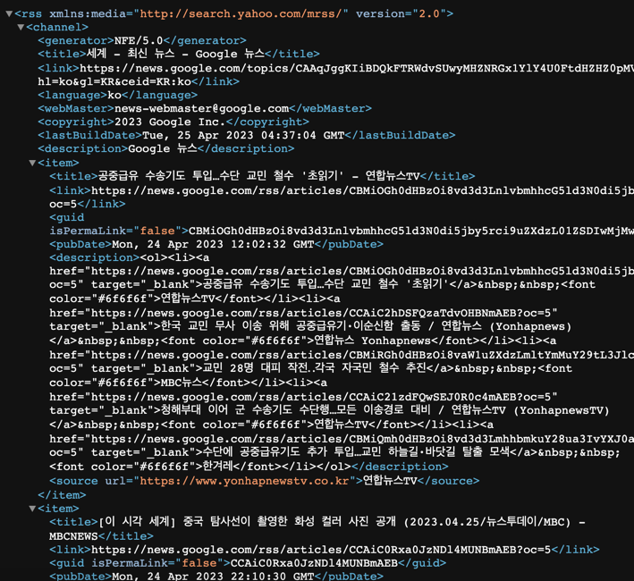
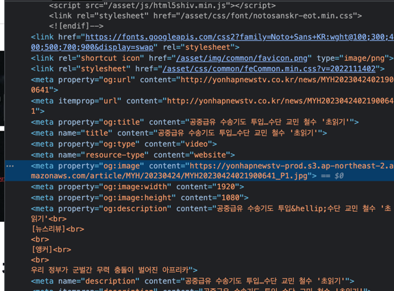
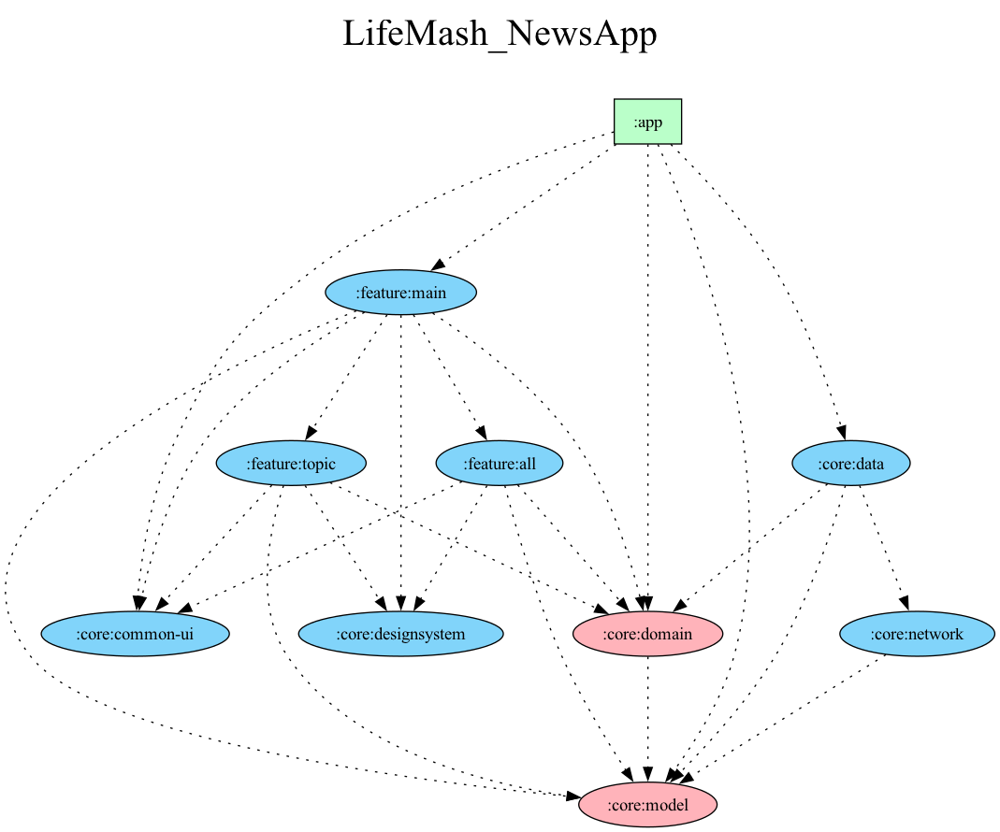

# LifeMash-NewsApp

LifeMash is a cutting-edge, mobile news application designed with the modern user in mind.
It harnesses the power of the latest technologies to deliver a seamless and engaging news reading
experience. This application is built using Jetpack Compose for UI, Material Design for styling, and
leverages a combination of Retrofit, OkHttp, and Jsoup for efficient data retrieval and processing.
The architecture is modularized for scalability and maintenance, while dependency injection is
managed with Hilt for optimal performance. WebView is utilized for an integrated web browsing
experience.

 "

## Core Features and Technologies

### Jetpack Compose

Jetpack Compose is utilized for building native UIs in a declarative way, ensuring a modern and
efficient development process.

### Material Design

The application follows Material Design guidelines to provide a visually appealing and intuitive
user interface.

### Networking with Retrofit and OkHttp

Retrofit and OkHttp are used for network operations, fetching news data efficiently from various
online sources.

### Jsoup: Web Scraping and HTML Parsing

Jsoup, a Java library, is employed for web scraping and HTML parsing, facilitating the extraction
and manipulation of web data.

Key Features of Jsoup:

- HTML Parsing: Transform web page HTML into a manageable DOM structure.
- CSS Selector Support: Easily select specific elements on web pages using CSS selectors.
- Data Extraction: Extract text, attributes, and links from web pages.
- Data Manipulation: Modify HTML elements on web pages, including adding, editing, or removing
  content.
- Web Crawling: Automate the process of web scraping across multiple pages.

Although HTML data crawling is less common in apps preferring server communications and JSON data
formats, Jsoup’s robust features make web scraping, data mining, and other tasks straightforward and
efficient.

### Tikxml: XML Data Parsing

For projects like fetching Google News, which provides RSS feed data in XML format, Tikxml is chosen
as the XML parser due to the deprecation and unsupported nature of alternatives in the context of
Android development.

Usage:
Refer to the
Tikxml [Documentation](!https://github.com/Tickaroo/tikxml/blob/master/docs/AnnotatingModelClasses.md)
for guidance on annotating model classes for XML parsing.

RSS Data Integration
Google News and other websites provide access to news data in RSS XML format, which can be easily
accessed and parsed using the capabilities provided by Tikxml.

Approach to Metadata:
The app cleverly navigates the lack of image data in RSS feeds by parsing the metadata of news
articles, specifically targeting og:image and og:title tags to enhance news presentation.

*Metadata, or data about data, provides essential information about the structure, meaning,
characteristics, and location of primary data.

## Dependency Graph

## Updates

### 2023.04.26

- Transitioned to SBS News due to Google News restrictions on image retrieval, ensuring rich media
  content remains a part of the news experience.
